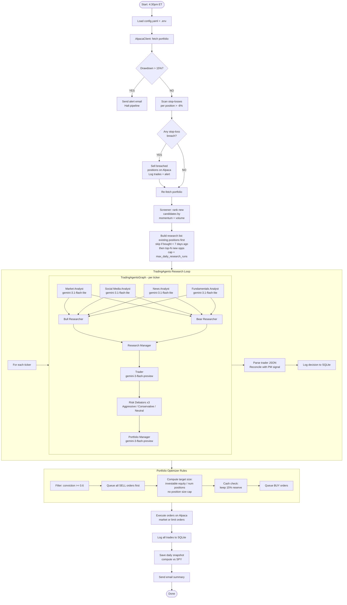

# Auto-Trader System Workflow

## How to Run (Local)

```bash
# Install dependencies (first time or after pyproject.toml changes)
uv sync

# Run the pipeline
uv run python -m src.main
```

Scheduled automatically at **4:30pm ET Mon–Fri** via cron in production (VPS uses `setup.sh` + `requirements.txt`).

---

## Full Pipeline Diagram



---

## Key Configuration

| Setting | File | Current Value |
|---|---|---|
| LLM Provider | `config.yaml` | `openrouter` |
| Analyst model | `config.yaml` | `google/gemini-3.1-flash-lite-preview` |
| Trader/PM model | `config.yaml` | `google/gemini-3-flash-preview` |
| Paper trading | `config.yaml` | `true` |
| Alpaca endpoint | `.env` | `https://paper-api.alpaca.markets` |
| Run schedule | `config.yaml` | `16:30 ET` |
| Tickers | `config.yaml` | 15 equities (NVDA, AAPL, GOOGL, MSFT, ...) |
| Tickers/day | `config.yaml` | 8 new + all existing positions |
| Max research runs | `config.yaml` | 15/day |

## Risk Rules

| Rule | Threshold | Behaviour |
|---|---|---|
| Portfolio drawdown | > 15% from peak | Halt all trading, send alert |
| Per-position stop-loss | < -8% from entry | Immediate market sell |
| Cash reserve | 15% always held | Excluded from investable pool |
| Conviction minimum | ≥ 0.60 | Lower-confidence decisions rejected |
| Recently bought skip | < 7 days since buy | Skip research, free slots for new candidates |
| Daily research cap | 15 runs/day | Remaining tickers deferred to next day |

## Switching to Live Trading

When ready to go live with $10k:

1. Fund Alpaca live account with $10k
2. Generate **live** Alpaca API keys (different from paper keys)
3. Update `.env`:
   ```
   ALPACA_API_KEY=<live key>
   ALPACA_SECRET_KEY=<live secret>
   ALPACA_BASE_URL=https://api.alpaca.markets
   ```
4. Update `config.yaml`:
   ```yaml
   paper_trading: false
   ```

## Data Sources

| Data | Source | API Key |
|---|---|---|
| Price / OHLCV / technicals | yfinance (free) | None |
| News | yfinance (free) | None |
| Screener price history | Alpha Vantage | `ALPHA_VANTAGE_API_KEY` |
| SPY benchmark comparison | Alpha Vantage | `ALPHA_VANTAGE_API_KEY` |
| LLM inference | OpenRouter | `OPENROUTER_API_KEY` |
| Order execution | Alpaca | `ALPACA_API_KEY` / `ALPACA_SECRET_KEY` |

## File Map

```
src/main.py                    — daily pipeline entry point
src/config.py                  — loads config.yaml + .env → typed Config
src/risk/circuit_breaker.py    — drawdown breaker + stop-loss scan
src/screener/universe.py       — momentum + volume ranking
src/research/runner.py         — wraps TradingAgentsGraph per ticker
src/portfolio/optimizer.py     — converts decisions → orders
src/execution/alpaca_client.py — places orders, reads portfolio
src/db/store.py                — SQLite: trades, decisions, snapshots
src/notifications/email_alert.py — SendGrid alerts + daily summary

tradingagents/                 — TradingAgents fork (multi-agent graph)
  tradingagents/graph/trading_graph.py  — main graph entry: .propagate()
  tradingagents/agents/analysts/        — 4 analyst agents
  tradingagents/agents/researchers/     — bull + bear researchers
  tradingagents/agents/managers/        — research manager + portfolio manager
  tradingagents/agents/risk_mgmt/       — 3 risk debators
  tradingagents/agents/trader/          — trader agent
  tradingagents/llm_clients/            — OpenRouter/OpenAI/Anthropic/Google clients
  tradingagents/default_config.py       — LLM defaults (overridden by runner.py)

config.yaml                    — all user-configurable settings
.env                           — secrets (never commit)
logs/trades.db                 — SQLite database
logs/app.log                   — rotating log file
```
